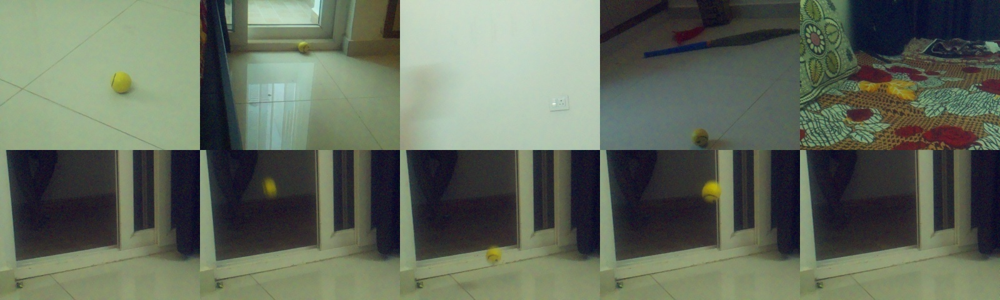
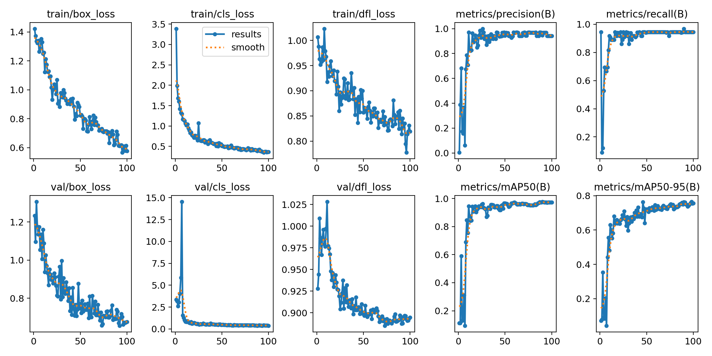
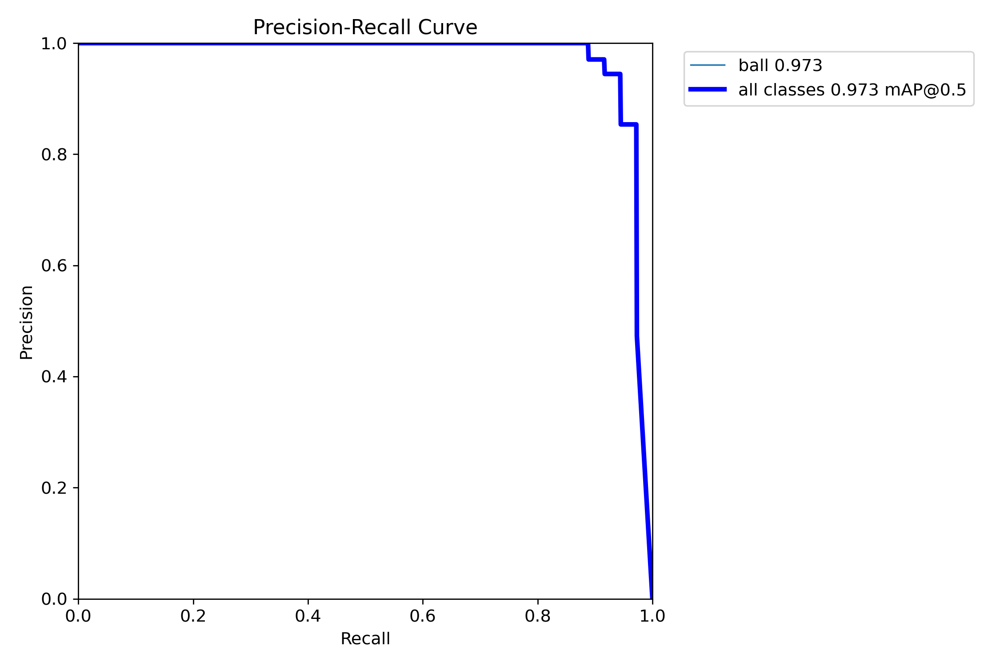
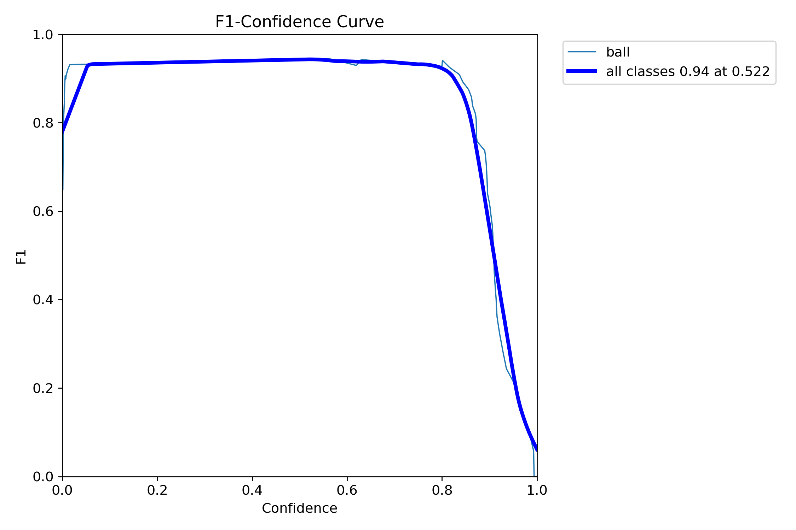
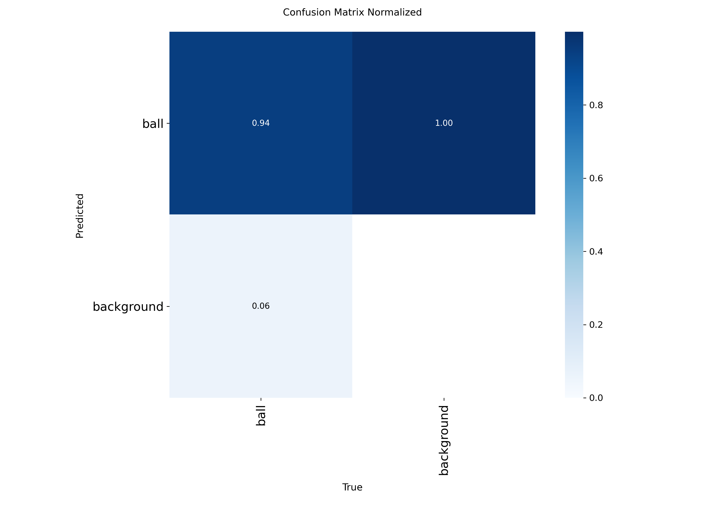
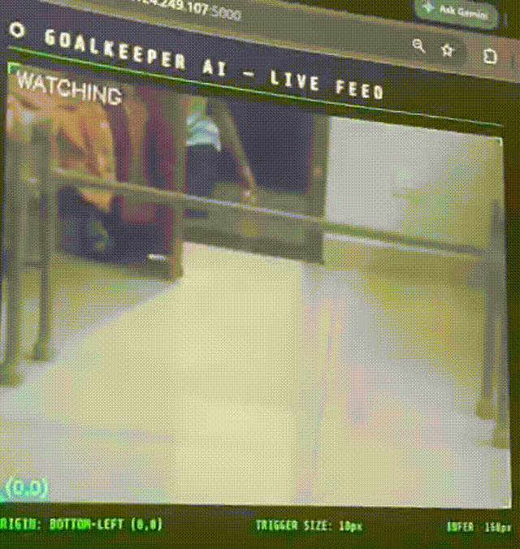
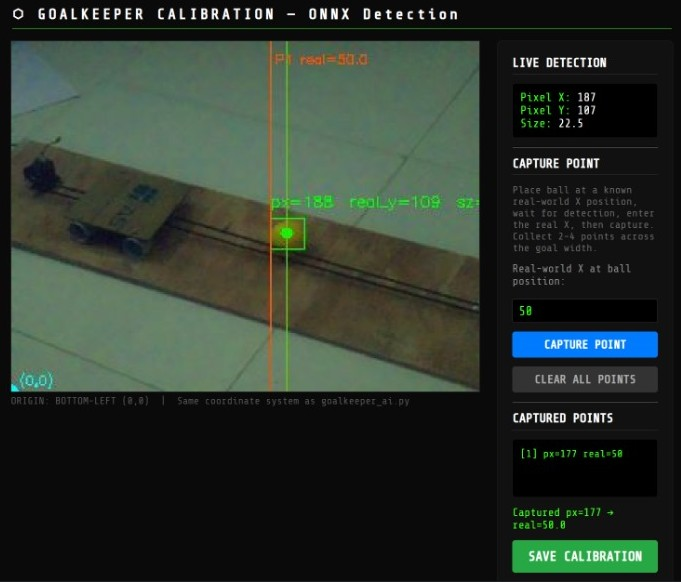
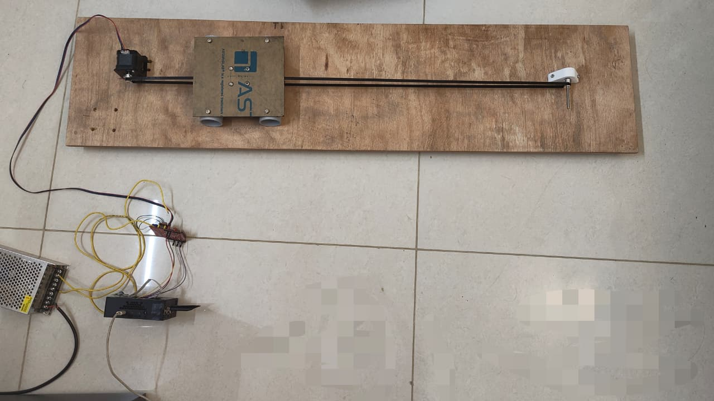

# AI Goalkeeper — A Real-Time Edge AI System for Autonomous Ball Interception

---

## 1. Problem Statement

Autonomous goalkeeping is a compelling robotics challenge that requires detecting a fast-moving ball, predicting its trajectory and physically intercepting it; all within a fraction of a second. Conventional robotic goalkeeper designs rely on servo motors with a rotating arm, which suffer from a fundamental geometric limitation: the effective blocking reach at the corners of the goal is severely reduced due to the fixed pivot length of the arm. A servo positioned at the center cannot reach to block a well-aimed shot due to its length. This project addresses that limitation by replacing the rotary servo with a **linear stepper motor driven blocker**; a flat panel that translates horizontally across the full goal width, providing uniform reach at every point from left post to right post.

The entire sense–predict–act loop must complete well within the ball's travel time, making cloud or remote processing completely impractical. This project is therefore implemented as a fully self-contained **Edge AI system** on a Raspberry Pi 4, running a YOLOv8n ONNX model at ~20 FPS with ~50 ms inference latency. It serves as a **proof of concept** demonstrating that on-device deep learning combined with classical trajectory regression can drive real-time physical actuation on edge hardware.
 
**Key objectives:**
- Detect an incoming football in real time (≥20 FPS) on Raspberry Pi 4 using a compressed YOLOv8n ONNX model
- Distinguish an in-flight ball from a stationary or held ball using a flight gate algorithm to prevent false actuations
- Predict the ball's future X position at the goal plane using linear trajectory regression over a rolling frame history
- Map predicted pixel coordinates to real-world centimetres via a one-time camera calibration step
- Actuate a linear stepper motor blocker to the predicted position before the ball arrives, and return to home automatically after each play

---

## 2. Proposed Solution (Overview)

The AI Goalkeeper is edge AI pipeline running entirely on a Raspberry Pi 4 with no cloud dependency. A Pi Camera captures live frames which are processed by an on-device YOLOv8n ONNX model. Detected ball positions feed a rolling trajectory buffer. A flight gate algorithm distinguishes a ball in motion from one being held or stationary. Once in-flight, two parallel predictions run; 1) Future X position via linear regression 2) Time-to-impact via size-growth extrapolation. When time-to-impact drops below the motor's reaction threshold, the predicted X is mapped from pixel coordinates to real-world units based on previously calibrated transform and a stepper motor drives the linear blocker to intercept. If no ball is detected for 3 seconds, the blocker automatically returns to the home position (centre in current case). A Flask web dashboard streams the annotated video feed for live monitoring.

```
Camera (320×240 @ 60 FPS)
        │
        ▼
YOLOv8n ONNX inference (160px, ~50 ms)
        │
        ▼
Flight Gate  ──── HELD/STATIC → ignore
        │
     IN-FLIGHT
        │
        ▼
Trajectory History (deque, last 10 frames)
        │
        ├── predict_x_at_future()   →  predicted pixel X (TIME_TO_REACT seconds ahead)
        └── predict_time_to_impact() →  TTI countdown
                        │
                    TTI ≤ TIME_TO_REACT
                        │
                        ▼
              Calibration mapping  (pixel X → real-world cm)
                        │
                        ▼
              Stepper motor command  (non-blocking queue)
                        │
                        ▼
              Blocker moves to predicted position
                        │
                        ▼
              ┌─────────────────────────────┐
              │  No detection timer starts  │
              │  Ball seen again? → reset   │
              │  3 seconds elapsed?         │
              └────────────┬────────────────┘
                           │
                    timer ≥ 3.0 s
                           │
                           ▼
              Blocker returns to HOME (0.0 cm)
```
---

## 3. Hardware & Software Setup

### Hardware

| Component | Details |
|---|---|
| Edge platform | Raspberry Pi 4 Model B (4 GB RAM) |
| Camera | Pi Camera Module 2 (IMX219), 320×240 @ 60 FPS |
| Actuator | NEMA 17 stepper motor |
| Motor driver | A4988 stepper driver on CNC Shield V3 |
| Drive system | GT20 belt and pulley system |
| Power | 48V supply for motor, 5V USB-C for Pi |
| Mounting | Wooden base frame ~90 cm wide |

### Software

| Tool | Purpose |
|---|---|
| Roboflow | Dataset annotation, labelling and augmentation |
| Python 3.11 | Main application language |
| YOLOv8n | Ball detection model |
| ONNX Runtime 1.25.1 | Optimised on-device inference |
| OpenCV 4.x | Frame capture and MJPEG streaming |
| Picamera2 | Pi Camera interface |
| Flask | Live web dashboard (MJPEG stream) |

---

## 4. Data Collection & Dataset Preparation

- **Data source:** Custom dataset collected using two dedicated capture scripts:
  - `snapshots.py` — captured rapid burst frames of a ball being thrown and rolled toward the goal from various angles, distances and lighting conditions.
  - `photos.py` — captured static images of different backgrounds with and without the ball in various positions, used to improve the model's ability to reject false positives and generalise across environments.
- **Total samples:** ~250 images; single class: `ball`
- **Split:** 80% train / 20% validation
- **Labelling:** All images containing the ball were annotated with bounding boxes using Roboflow. Background images without the ball were included as unannotated negative samples to reduce false positives.


*Figure 1: Sample annotated images from training dataset — bounding boxes around ball*

---

## 5. Model Design, Training & Evaluation

- **Architecture:** YOLOv8n (nano) — chosen for its small parameter count and suitability for single-class real-time detection on constrained hardware. Uses a CSPNet backbone with a decoupled detection head.
- **Input resolution:** 320×320 px for training; reduced to 160×160 px at inference on Pi to maximise FPS
- **Training setup:**

| Parameter | Value |
|---|---|
| Framework | Ultralytics YOLOv8 |
| Base model | `yolov8n.pt` (COCO pretrained — transfer learning) |
| Epochs | 100 |
| Batch size | 8 |
| Optimizer | Auto (SGD with momentum 0.937) |
| Learning rate | lr0=0.01, lrf=0.01 |
| Image size | 320×320 |
| Classes | 1 (`ball`) |
| Train images | 200 |
| Val images | 50 |
| Total dataset | 250 images (Roboflow export) |

- **Evaluation metrics (final epoch — epoch 100):**

| Metric | Value |
|---|---|
| Precision | 0.576 |
| Recall | 0.363 |
| mAP@0.5 | 0.819 |
| mAP@0.5:0.95 | 0.942 |
| F1 Score | 0.447 |


*Figure 2: YOLOv8n training curves — box loss, classification loss, mAP@0.5 and mAP@0.5:0.95 over 100 epochs*


*Figure 3: Precision-Recall curve*


*Figure 4: F1-Confidence curve*


*Figure 5: Normalised confusion matrix*


*Figure 6: Model predictions on unseen validation images*

---

## 6. Model Compression & Efficiency Metrics

The trained `.pt` model was exported to two optimised formats for deployment comparison. Compression was achieved through format conversion and input resolution reduction.

**Techniques used:**

- **ONNX export** (`model.export(format='onnx')`) — removes PyTorch runtime overhead, enables ONNX Runtime CPU-level graph optimisations. Used for final deployment.
- **TFLite INT8 quantisation** (`best_int8.tflite`) — full integer quantisation explored as an alternative, halving model size at the cost of some accuracy.
- **Input resolution reduction** — inference run at 160×160 instead of training resolution 320×320, reducing pixel count by 4× and directly cutting compute per frame.

| Format | Size | Latency | Accuracy | Notes |
|---|---|---|---|---|
| `best.pt` (PyTorch) | 6.1 MB | - | - | Training format, not deployed | 
| `best.onnx` (ONNX Runtime) | 11.5 MB | 45-50 ms | >80% |  **Deployed on Pi** |
| `best_int8.tflite` | 3.0 MB | 20-25 ms | <40% | Smallest, accuracy trade-off |

**On-device efficiency:**

| Metric | Value |
|---|---|
| Inference latency (Pi 4, ONNX) | ~45–50 ms/frame |
| Effective pipeline FPS | ~20 FPS |
| ONNX execution provider | CPUExecutionProvider |
| RAM usage (approx.) | ~350 MB |
| CPU utilisation (approx.) | ~65 % |

**Trade-offs observed:**
- Reducing input to 160px significantly lowers recall for distant/small balls — the model only detects reliably once the ball appears large enough in frame (~10px apparent size). This is acceptable since the system predicts trajectory from first detection onward.
- ONNX is ~2× larger than `.pt` on disk but faster at runtime due to graph optimisation.
- INT8 was not used despite smallest size — accuracy drop on a single-class small-object detector was not worth the size saving at this scale.

---

## 7. Model Deployment & On-Device Performance

**Deployment steps:**
1. Train YOLOv8n locally using Ultralytics.
2. Export to ONNX: `model.export(format='onnx')`
3. Copy `best.onnx` to Raspberry Pi working directory
4. Install dependencies on Pi:
```bash
   pip install ultralytics onnxruntime picamera2 flask RPi.GPIO numpy opencv-python
```
5. Run one-time pixel-to-real-world calibration: `python calib.py`
6. Set `TRIGGER_SIZE` in `goalkeeper_ai.py` to match the apparent ball size at the goal plane (see note below)
7. Run main system: `python goalkeeper_ai.py`

**Calibration (`calib.py`):**
- Calibration is done by placing the ball at 2–4 known real-world positions across the goal width and capturing the corresponding pixel X values. A linear scale and offset are computed from these points and saved to `calibration.json`. The goal center is defined as 0 cm, left is negative and right is positive — directly matching the motor's movement convention.

**Setting `TRIGGER_SIZE`:**
`TRIGGER_SIZE` defines the apparent pixel size of the ball (average bounding box side length) at the goal plane i.e. when the ball is physically at the goal line in front of the camera. This value is setup-dependent and must be measured for each deployment. To find it: place the ball stationary at the goal line and read the `Sz:` value shown on the live detection feed. Set `TRIGGER_SIZE` to that value. The TTI countdown fires the motor when the ball is predicted to reach this size, ensuring actuation happens before the ball crosses the line.

**Software architecture — multithreading design:**

The system runs four concurrent threads to prevent any single component from blocking another:

| Thread | Role |
|---|---|
| **Camera thread** | Continuously captures frames from Pi Camera into `latest_frame` — never waits for inference |
| **Tracking thread** | Runs YOLO inference, flight gate, trajectory regression, TTI computation — main AI loop |
| **Motor thread** | Consumes target positions from a `queue.Queue(maxsize=1)` — blocking step loop runs here, never in the AI thread |
| **Flask thread** | Serves annotated MJPEG stream to browser — reads `output_frame` via lock |

A `threading.Lock` protects `output_frame` between the tracking and Flask threads. The motor queue uses `maxsize=1` with drain-before-put; if the motor is still moving when a new command arrives, the stale command is discarded and replaced with the latest predicted position.

**Trajectory prediction algorithm:**
Two functions run every in-flight frame:
- `predict_x_at_future(history, TIME_TO_REACT)` — fits `X vs time` linearly using `numpy.polyfit` over the last 10 detections and extrapolates `TIME_TO_REACT` seconds ahead. Updated every 2 new in-flight frames (frames 3, 5, 7...) to reduce jitter.
- `predict_time_to_impact(history, TRIGGER_SIZE)` — fits `size vs time` linearly and extrapolates when ball will reach `TRIGGER_SIZE` pixels. When TTI ≤ `TIME_TO_REACT`, motor command fires.

**On-device performance summary:**

| Metric | Value |
|---|---|
| Inference time | ~45–50 ms |
| Pipeline FPS | ~20 FPS |
| Confidence threshold | 0.5 |
| ONNX execution provider | CPUExecutionProvider |
| Camera resolution | 320×240 @ 60 FPS |
| Inference resolution | 160×160 |
| Motor actuation latency | ~300–500 ms (travel dependent) |
| Home return timeout | 3.0 seconds after last detection |


*Figure 7: Live YOLO detection feed — bounding box, predicted X line (red dashed), flight status overlay*


*Figure 8: calib.py dashboard — ONNX detection used to map pixel X to real-world cm*

---

## 8. System Prototype


*Figure 9: Full hardware setup — Raspberry Pi 4, Pi Camera, NEMA17 on wooden base with GT2 belt drive*


**System architecture:**

```
┌─────────────┐     RGB frame      ┌──────────────────┐
│  Pi Camera  │ ──────────────►    │  YOLOv8n ONNX    │
│  320×240    │                    │ 160px inference  │
└─────────────┘                    └────────┬─────────┘
                                            │ cx, cy, ball_size
                                            ▼
                                   ┌─────────────────┐
                                   │  Flight Gate    │
                                   │  thrown/rolling │
                                   └────────┬────────┘
                                            │ in-flight confirmed
                                            ▼
                                   ┌─────────────────┐
                                   │  Trajectory     │
                                   │  Regression     │
                                   │  predict_x /TTI │
                                   └────────┬────────┘
                                            │ predicted pixel X
                                            ▼
                                   ┌─────────────────┐
                                   │  map to real X  │
                                   │  pixel → cm     │
                                   └────────┬────────┘
                                            │ real_x (cm)
                                            ▼
                                   ┌─────────────────┐
                                   │  Motor Thread   │
                                   │  NEMA17 + A4988 │
                                   │  CNC Shield V3  │
                                   └─────────────────┘
```

**Motor and driver wiring:**
The NEMA17 stepper is driven by an A4988 driver mounted on a CNC Shield V3, connected to Raspberry Pi GPIO (STEP=18, DIR=17, ENABLE=25) via jumper wires. Motor is powered by a dedicated 48V supply; Pi is powered separately via 5V USB-C. The GT20 belt-pulley system translates rotational motor steps to linear horizontal displacement of the blocker panel.

---

## 9. Conclusions & Limitations

The project successfully demonstrates that both subsystems — edge AI ball detection with X prediction, and stepper motor control — work correctly independently. The YOLO pipeline runs at ~20 FPS with ~50 ms inference latency on Raspberry Pi 4, accurately detecting thrown and rolling balls, predicting future X position via trajectory regression and mapping pixel coordinates to real-world units through a one-time calibration. The motor subsystem independently moves the blocker accurately to any commanded position across the full goal width. As a proof of concept, this validates the core idea of replacing a servo-based goalkeeper with a linear stepper-driven blocker to achieve uniform reach across the entire goal.

However, when both subsystems were combined for the full end-to-end demo, the long GPIO signal wires between the Raspberry Pi and the A4988 driver introduced electrical noise and signal degradation, resulting in visible latency and occasional missed steps in the motor response. This integration challenge meant the complete autonomous interception loop could not be demonstrated at full speed, though both components are individually verified to work as intended.

**Limitations:**
- Long GPIO wires between Pi and motor driver introduced electrical noise causing visible actuation latency in the combined demo — the primary integration bottleneck
- Detection range is limited — the model reliably detects the ball only once apparent size reaches ~10px, leaving a short prediction window for fast throws
- Linear regression assumes a straight-line trajectory; curved, bouncing or spin-affected balls reduce prediction accuracy
- Small training dataset (250 images) with very few enviroment changes limits generalisation to different lighting and backgrounds
- Calibration must be repeated if camera or goal position changes

---

## 10. Future Work

- **Eliminate long wire noise:** Mount the motor driver physically close to the Pi using a HAT or short ribbon cable; use optocouplers on signal lines for proper electrical isolation
- **Improved trajectory prediction:** Replace linear regression with a Kalman filter or LSTM for robustness against noise, occlusion and curved trajectories
- **Faster inference:** Explore TFLite INT8 (`best_int8.tflite`, 3.0 MB) to target sub-30 ms inference or migrate to a Coral Edge TPU
- **Larger dataset:** More lighting conditions, ball types and angles to improve recall at range
- **Hardware end-stops:** Add limit switches to motor rail to prevent mechanical over-travel and enable automatic homing on startup
- **Active learning:** Use Roboflow active learning to continuously improve the model from live deployment footage

---

## 11. Challenges & Mitigation

| Challenge | Mitigation |
|---|---|
| Prediction line jittering every frame | Updated prediction only at in-flight frames 3, 5, 7... (every 2 frames) — significantly more stable |
| Rolling ball on ground not triggering flight gate | Removed Y-axis check entirely; gate fires on X displacement > 6px OR size growth > 0.05 px/frame |
| Motor blocking YOLO inference thread | Motor runs in dedicated thread consuming from `queue.Queue(maxsize=1)` — AI loop never waits for motor |
| Pixel-to-real-world mapping for motor | Built `calib.py` using same ONNX model — captures pixel X at known positions, fits linear scale+offset |
| False actuation when ball is held | Flight gate requires minimum size growth slope AND X displacement before classifying as in-flight |

## 12. References

- Roboflow Universe — https://universe.roboflow.com
- A4988 Stepper Motor Driver datasheet — https://www.pololu.com/file/0J450/A4988.pdf
- Rpi Documnetation - https://www.raspberrypi.com/documentation/
- Rpi GPIO schematic - https://cdn.sparkfun.com/assets/learn_tutorials/1/5/9/5/GPIO.png
- CNC Shield V3 pins schematic - https://osoyoo.com/wp-content/uploads/2017/04/Arduino-CNC-Shield-Scematics-V3.XX_.jpg
